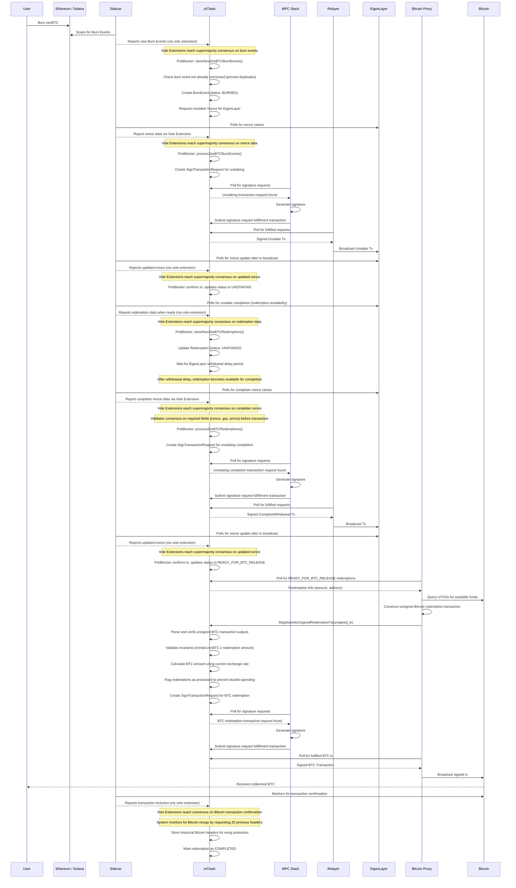
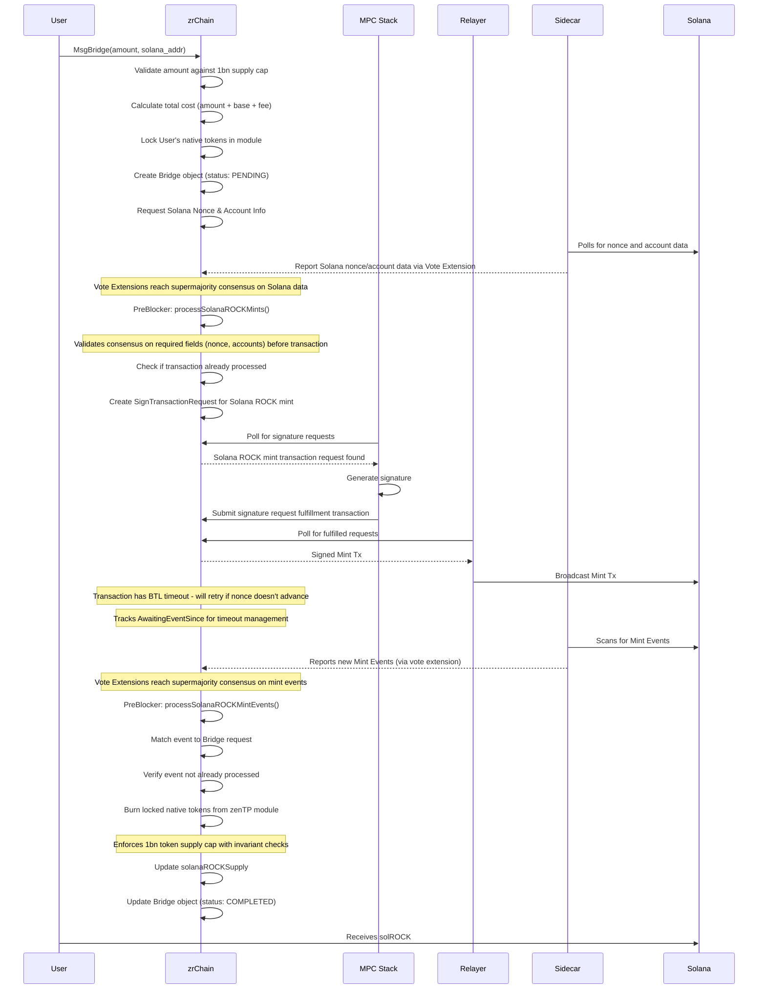
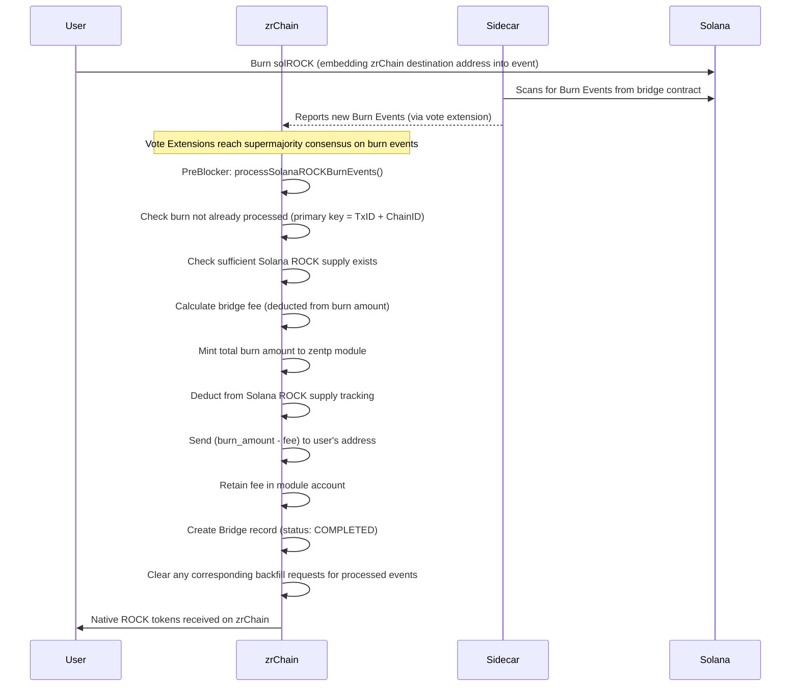

# zenBTC and zenTP Flows

This document outlines the sequence of operations for the zenBTC and zenTP protocols within the zrChain ecosystem, illustrated with Mermaid sequence diagrams.

## Overview of Consensus Mechanism

The zrChain network uses a **Vote Extension** based consensus mechanism where validators run sidecar processes that monitor external blockchains (Bitcoin, Solana, Ethereum) and report their state. Each validator submits their observed data as a vote extension, and only data that reaches **supermajority consensus** (>67% of voting power) is accepted and processed on-chain.

### Vote Extension Lifecycle

1. **ExtendVoteHandler**: Each validator's sidecar collects oracle data and creates vote extensions containing hashes
2. **VerifyVoteExtensionHandler**: Validators verify each other's vote extensions for basic validity  
3. **PrepareProposal**: The proposer aggregates vote extensions and determines consensus fields
4. **ProcessProposal**: All validators verify the proposed oracle data matches consensus
5. **PreBlocker**: Oracle data with consensus is applied to on-chain state and triggers transaction processing

### Vote Extension Process

1. **Sidecar Data Collection**: Each validator's sidecar monitors external chains and collects oracle data
2. **Vote Extension Creation**: During `ExtendVoteHandler`, validators create vote extensions containing hashes of their observed data
3. **Consensus Verification**: In `PrepareProposal`/`ProcessProposal`, the network determines which fields have supermajority consensus
4. **State Application**: In `PreBlocker`, only fields with consensus are processed and applied to on-chain state

This ensures that external blockchain state is only acted upon when there is strong validator agreement, providing security against oracle manipulation.

### Consensus Details

**Supermajority Threshold**: Most fields require >2/3 of total voting power to reach consensus  
**Simple Majority Fields**: Gas-related fields (ETH gas prices, Solana fees) use >1/2 threshold for faster updates  
**Deterministic Tie-Breaking**: When multiple values have equal vote power, lexicographic ordering ensures all validators select the same result  
**Field-Level Consensus**: Each data field (prices, nonces, events) reaches consensus independently, allowing partial state updates  

This granular consensus approach maximizes system uptime by allowing critical operations to proceed even when some oracle data is unavailable.

## Key Components

- **Sidecar**: Synchronised oracle system, polled by zrChain validators and enshrined by ROCK stake
- **Vote Extensions**: CometBFT mechanism to extend consensus over arbitrary non-tx data
- **MPC Stack**: Multi-party computation system that polls zrChain for key/signature requests and submits fulfillment transactions back to the chain
- **Relayer**: Service that broadcasts signed transactions to external blockchains
- **Bitcoin Proxy**: Specialized service for Bitcoin transaction monitoring and construction

## zenBTC Protocol

zenBTC allows for the trust-minimized bridging of Bitcoin to and from other blockchains like Solana and Ethereum.
The system allows for liquid restaking of tokens via platforms such as EigenLayer.

### Deposit and Mint

This flow describes how a user deposits BTC and how it is relayed to mint zenBTC on a destination chain.

```mermaid
sequenceDiagram
    participant User
    participant Web Frontend
    participant zrChain
    participant MPC Stack
    participant Bitcoin
    participant Bitcoin Proxy
    participant Sidecar
    participant Relayer
    participant EigenLayer
    participant Solana
    participant Ethereum

    User->>Web Frontend: Request BTC Deposit Address
    Web Frontend->>zrChain: Request new deposit address
    zrChain->>zrChain: Create new Bitcoin key request
    MPC Stack->>zrChain: Poll for key requests
    zrChain-->>MPC Stack: Bitcoin key request found
    MPC Stack->>MPC Stack: Generate new Bitcoin key
    MPC Stack->>zrChain: Submit key request fulfillment transaction
    zrChain-->>Web Frontend: Return deposit address
    Web Frontend-->>User: Display deposit address

    User->>Bitcoin: Deposit BTC to provided address
    
    Bitcoin Proxy->>Bitcoin: Detects deposit
    Bitcoin Proxy->>Bitcoin Proxy: Generate Merkle proof of BTC deposit transaction
    Bitcoin Proxy->>zrChain: MsgVerifyDepositBlockInclusion(proof)

    Sidecar->>Bitcoin: Polls for new block headers
    Sidecar->>Ethereum: Polls for ETH/BTC price feeds (Chainlink)
    Sidecar->>Ethereum: Polls for gas prices and estimates
    Sidecar->>Solana: Polls for lamports per signature fee
    Sidecar-->>zrChain: Report BTC Block Header, prices & network fees (via vote extension)
    Note over zrChain: Vote Extensions reach supermajority consensus on external chain data

    zrChain->>zrChain: Verify Merkle proof against Bitcoin block headers
    zrChain->>zrChain: Validate transaction outputs and amounts
    zrChain->>zrChain: Create PendingMintTransaction (status: DEPOSITED)
    zrChain->>zrChain: Request Staker Nonce for EigenLayer

    Sidecar->>EigenLayer: Polls for nonce values
    Sidecar-->>zrChain: Report nonce data via Vote Extension
    Note over zrChain: Vote Extensions reach supermajority consensus on nonce data
    Note over zrChain: Validates consensus on required fields (nonce, gas, prices) before transaction
    zrChain->>zrChain: PreBlocker: processZenBTCStaking()
    zrChain->>zrChain: Create SignTransactionRequest for staking
    MPC Stack->>zrChain: Poll for signature requests
    zrChain-->>MPC Stack: Staking transaction request found
    MPC Stack->>MPC Stack: Generate signature
    MPC Stack->>zrChain: Submit signature request fulfillment transaction
    Relayer->>zrChain: Poll for fulfilled requests
    zrChain-->>Relayer: Signed Stake Tx
    Relayer->>EigenLayer: Broadcast Stake Tx

    Sidecar->>EigenLayer: Polls for nonce update after tx broadcast
    Sidecar-->>zrChain: Reports updated nonce (via vote extension)
    Note over zrChain: Vote Extensions reach supermajority consensus on updated nonce
    zrChain->>zrChain: PreBlocker confirms tx, updates status to STAKED
    zrChain->>zrChain: Request Minter Nonce (ETH or SOL)

    alt Mint on Solana
        Sidecar->>Solana: Polls for nonce and account data
        Sidecar-->>zrChain: Report Solana nonce/account data via Vote Extension
        Note over zrChain: Vote Extensions reach supermajority consensus on Solana data
        zrChain->>zrChain: PreBlocker: processZenBTCMintsSolana()
        Note over zrChain: Checks for consensus on required data for transaction construction
        zrChain->>zrChain: Create SignTransactionRequest for Solana mint
        MPC Stack->>zrChain: Poll for signature requests
        zrChain-->>MPC Stack: Solana mint transaction request found
        MPC Stack->>MPC Stack: Generate signature
        MPC Stack->>zrChain: Submit signature request fulfillment transaction
        Relayer->>zrChain: Poll for fulfilled requests
        zrChain-->>Relayer: Signed Mint Tx
        Relayer->>Solana: Broadcast Mint Tx
        Note over zrChain: Transaction has BTL timeout - will retry if sidecars have consensus + nonce doesn't advance
        Note over zrChain: Tracks AwaitingEventSince for timeout management
        
        Sidecar->>Solana: Scans for Mint Events
        Sidecar-->>zrChain: Reports new Mint Events (via vote extension)
        Note over zrChain: Vote Extensions reach supermajority consensus on mint events
        zrChain->>zrChain: PreBlocker: processSolanaZenBTCMintEvents()
        zrChain->>zrChain: Match event to PendingMintTransaction
        zrChain->>zrChain: Update PendingMintTransaction (status: MINTED)
        Note over zrChain: Updates zenBTC supply tracking (PendingZenBTC → MintedZenBTC)
        zrChain-->>User: zenBTC minted on Solana
    else Mint on Ethereum
        Sidecar->>Ethereum: Polls for nonce values 
        Sidecar-->>zrChain: Report Ethereum nonce data via Vote Extension
        Note over zrChain: Vote Extensions reach supermajority consensus on nonce data
        zrChain->>zrChain: PreBlocker: processZenBTCMintsEthereum()
        Note over zrChain: Checks for consensus on required data for transaction construction
        zrChain->>zrChain: Create SignTransactionRequest for Ethereum mint
        MPC Stack->>zrChain: Poll for signature requests
        zrChain-->>MPC Stack: Ethereum mint transaction request found
        MPC Stack->>MPC Stack: Generate signature
        MPC Stack->>zrChain: Submit signature request fulfillment transaction
        Relayer->>zrChain: Poll for fulfilled requests
        zrChain-->>Relayer: Signed Mint Tx
        Relayer->>Ethereum: Broadcast Mint Tx

        Sidecar->>Ethereum: Polls for nonce update after tx broadcast
        Sidecar-->>zrChain: Reports updated nonce (via vote extension)
        Note over zrChain: Vote Extensions reach supermajority consensus on updated nonce
        zrChain->>zrChain: PreBlocker confirms tx, updates status to MINTED
        Note over zrChain: Updates zenBTC supply tracking (PendingZenBTC → MintedZenBTC)
        zrChain-->>User: zenBTC minted on Ethereum
    end
```

### Redemption and Burn

This flow describes how a user burns zenBTC on a destination chain to redeem their original BTC.

## zenTP (Zenrock Transport Protocol)

zenTP is used for bridging native zrChain assets (currently only ROCK) to other blockchains (currently only Solana).
The protocol is a stripped-back iteration of zenBTC's bridging system, omitting restaking features amongst others.

### Bridge to Solana (Mint solROCK)

This flow describes bridging a native asset from zrChain to Solana, resulting in the minting of a corresponding SPL token (e.g., solROCK).

### Burn from Solana (Redeem native ROCK)

This flow describes burning an SPL token on Solana to redeem the original native asset back on zrChain.

