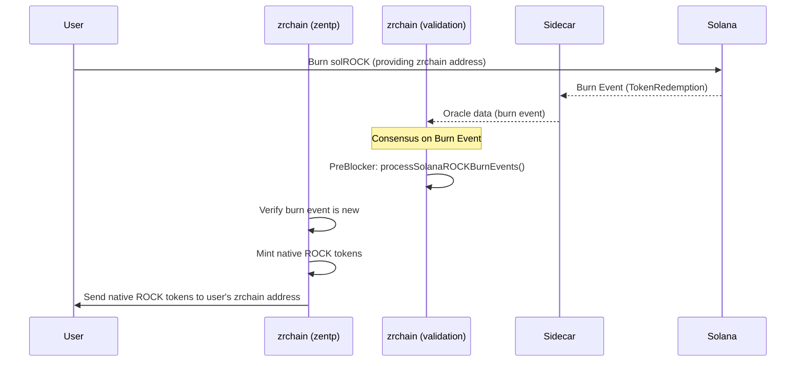

# ZenBTC and ZenTP Flows

This document outlines the sequence of operations for the ZenBTC and ZenTP protocols within the zrchain ecosystem, illustrated with Mermaid sequence diagrams.

## ZenBTC Protocol

ZenBTC allows for the trust-minimized bridging of Bitcoin to and from other blockchains like Ethereum and Solana.

### Deposit and Mint

This flow describes how a user deposits BTC and mints zenBTC on a destination chain.

```mermaid
sequenceDiagram
    participant User
    participant zrchain as zrchain (zenbtc)
    participant zrchain_val as zrchain (validation)
    participant Sidecar
    participant Bitcoin
    participant Ethereum
    participant Solana

    User->>Bitcoin: Deposit BTC
    User->>zrchain: MsgVerifyDepositBlockInclusion(proof)

    zrchain->>zrchain_val: Get BTC Block Header
    zrchain_val->>Sidecar: gRPC: GetBitcoinBlockHeaderByHeight()
    Sidecar->>Bitcoin: (via neutrino) Get Header
    Bitcoin-->>Sidecar: Header
    Sidecar-->>zrchain_val: Header
    zrchain_val-->>zrchain: Header

    zrchain->>zrchain: Verify BTC tx proof
    zrchain->>zrchain: Create PendingMintTransaction (status: DEPOSITED)
    zrchain->>zrchain_val: Request Staker Nonce

    Note over zrchain_val, Ethereum: Consensus for Staking on EigenLayer
    zrchain_val->>zrchain_val: PreBlocker: processZenBTCStaking()
    zrchain_val->>Ethereum: Construct & Submit Stake Tx (via Treasury)
    Ethereum-->>Sidecar: Stake Event
    Sidecar-->>zrchain_val: Oracle data (nonce update)

    zrchain_val->>zrchain: Update PendingMintTransaction (status: STAKED)
    zrchain_val->>zrchain_val: Request Minter Nonce (ETH or SOL)

    alt Mint on Ethereum
        Note over zrchain_val, Sidecar, Ethereum: Consensus for Minting zenBTC on Ethereum
        zrchain_val->>zrchain_val: PreBlocker: processZenBTCMintsEthereum()
        zrchain_val->>Ethereum: Construct & Submit Mint Tx (via Treasury)
        Ethereum-->>Sidecar: Mint Event
        Sidecar-->>zrchain_val: Oracle data (nonce update)
        zrchain_val->>zrchain: Update PendingMintTransaction (status: MINTED)
        zrchain->>User: zenBTC minted
    else Mint on Solana
        Note over zrchain_val, Sidecar, Solana: Consensus for Minting zenBTC on Solana
        zrchain_val->>zrchain_val: PreBlocker: processZenBTCMintsSolana()
        zrchain_val->>Solana: Construct & Submit Mint Tx (via Treasury)
        Solana-->>Sidecar: Mint Event
        Sidecar-->>zrchain_val: Oracle data (mint event)
        zrchain_val->>zrchain: processSolanaZenBTCMintEvents()
        zrchain->>zrchain: Update PendingMintTransaction (status: MINTED)
        zrchain->>User: zenBTC minted
    end
```

### Redemption and Burn

This flow describes how a user burns zenBTC on a destination chain to redeem their original BTC.

```mermaid
sequenceDiagram
    participant User
    participant zrchain as zrchain (zenbtc)
    participant zrchain_val as zrchain (validation)
    participant Sidecar
    participant Ethereum as Ethereum (or Solana)
    participant EigenLayer
    participant Bitcoin

    User->>Ethereum: Burn zenBTC
    Ethereum-->>Sidecar: Burn Event
    Sidecar-->>zrchain_val: Oracle data (burn event)

    Note over zrchain_val: Consensus on Burn Event
    zrchain_val->>zrchain: PreBlocker: storeNewZenBTCBurnEvents()
    zrchain->>zrchain: Create BurnEvent (status: BURNED)
    zrchain->>zrchain_val: Request Unstaker Nonce

    Note over zrchain_val, Sidecar, EigenLayer: Consensus for Unstaking from EigenLayer
    zrchain_val->>zrchain_val: PreBlocker: processZenBTCBurnEvents()
    zrchain_val->>EigenLayer: Construct & Submit Unstake Tx (via Treasury)
    EigenLayer-->>Sidecar: Unstake Initiated Event
    Sidecar-->>zrchain_val: Oracle data (nonce update)
    zrchain_val->>zrchain: Update BurnEvent (status: UNSTAKING)

    Note over Sidecar, EigenLayer: Sidecar monitors EigenLayer for unstake completion
    EigenLayer-->>Sidecar: Unstake Ready Event
    Sidecar-->>zrchain_val: Oracle data (redemption ready)

    zrchain_val->>zrchain: PreBlocker: storeNewZenBTCRedemptions()
    zrchain->>zrchain: Update Redemption (status: READY)
    zrchain_val->>zrchain_val: Request Completer Nonce

    zrchain_val->>zrchain_val: PreBlocker: processZenBTCRedemptions()
    zrchain_val->>EigenLayer: Construct & Submit CompleteUnstake Tx (via Treasury)
    EigenLayer-->>Sidecar: Unstake Complete Event
    Sidecar-->>zrchain_val: Oracle data (nonce update)
    zrchain_val->>zrchain: Update Redemption (status: COMPLETED)

    User->>zrchain: MsgSubmitUnsignedRedemptionTx(unsignedBtcTx)
    zrchain->>zrchain: Verify unsigned tx
    zrchain->>Bitcoin: Request signature for BTC tx (via Treasury)
    Bitcoin-->>User: Signed BTC Transaction
    User->>Bitcoin: Broadcast signed tx
```

## ZenTP Protocol

ZenTP (Zenrock Transport Protocol) is used for bridging native zrchain assets to other blockchains, such as Solana.

### Bridge to Solana (Mint solROCK)

This flow describes bridging a native asset from zrchain to Solana, resulting in the minting of a corresponding SPL token (e.g., solROCK).

```mermaid
sequenceDiagram
    participant User
    participant zrchain as zrchain (zentp)
    participant zrchain_val as zrchain (validation)
    participant Sidecar
    participant Solana

    User->>zrchain: MsgBridge(amount, solana_addr)
    zrchain->>zrchain: Lock User's native tokens
    zrchain->>zrchain: Create Bridge object (status: PENDING)
    zrchain->>zrchain_val: Request Solana Nonce & Account Info

    Note over zrchain_val, Sidecar, Solana: Consensus for Minting solROCK on Solana
    zrchain_val->>zrchain_val: PreBlocker: processSolanaROCKMints()
    zrchain_val->>Solana: Construct & Submit Mint Tx (via Treasury)

    Solana-->>Sidecar: Mint Event (TokensMintedWithFee)
    Sidecar-->>zrchain_val: Oracle data (mint event)

    zrchain_val->>zrchain: PreBlocker: processSolanaROCKMintEvents()
    zrchain->>zrchain: Match event to Bridge object
    zrchain->>zrchain: Burn locked native tokens
    zrchain->>zrchain: Update solanaROCKSupply
    zrchain->>zrchain: Update Bridge object (status: COMPLETED)
    User->>Solana: Receives solROCK
```

### Burn from Solana (Redeem native ROCK)

This flow describes burning an SPL token on Solana to redeem the original native asset back on zrchain.


