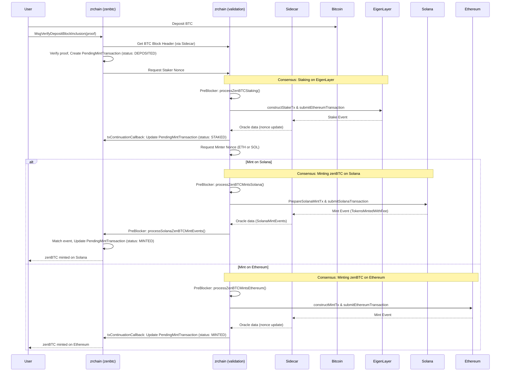
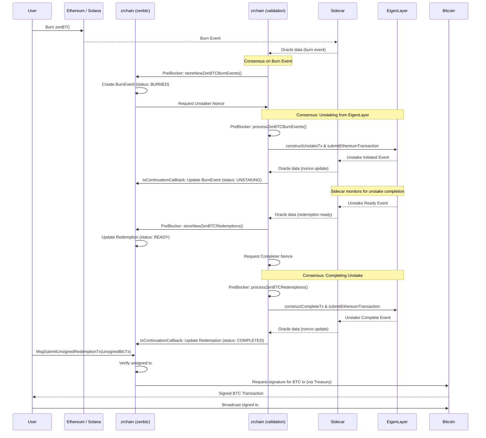
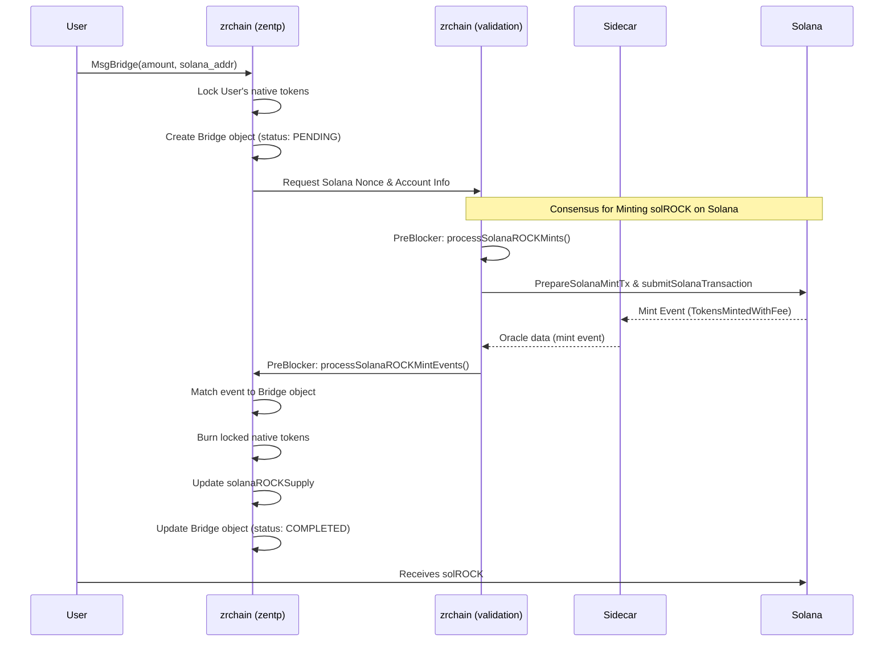

# ZenBTC and ZenTP Flows

This document outlines the sequence of operations for the ZenBTC and ZenTP protocols within the zrchain ecosystem, illustrated with Mermaid sequence diagrams.

## ZenBTC Protocol

ZenBTC allows for the trust-minimized bridging of Bitcoin to and from other blockchains like Ethereum and Solana.

### Deposit and Mint

This flow describes how a user deposits BTC and mints zenBTC on a destination chain.

### Redemption and Burn

This flow describes how a user burns zenBTC on a destination chain to redeem their original BTC.

## ZenTP Protocol

ZenTP (Zenrock Transport Protocol) is used for bridging native zrchain assets to other blockchains, such as Solana.

### Bridge to Solana (Mint solROCK)

This flow describes bridging a native asset from zrchain to Solana, resulting in the minting of a corresponding SPL token (e.g., solROCK).

### Burn from Solana (Redeem native ROCK)

This flow describes burning an SPL token on Solana to redeem the original native asset back on zrchain.

